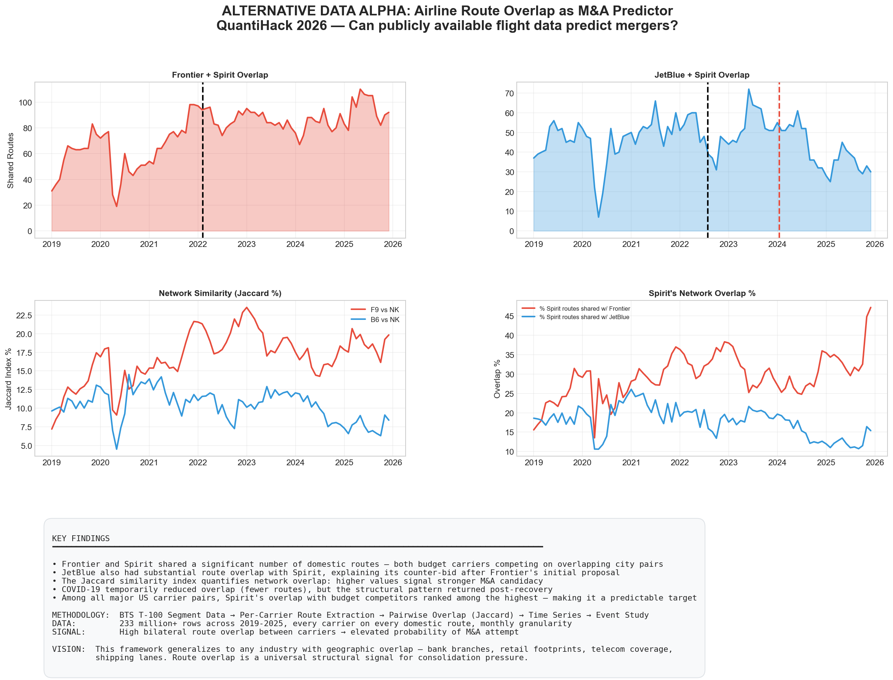
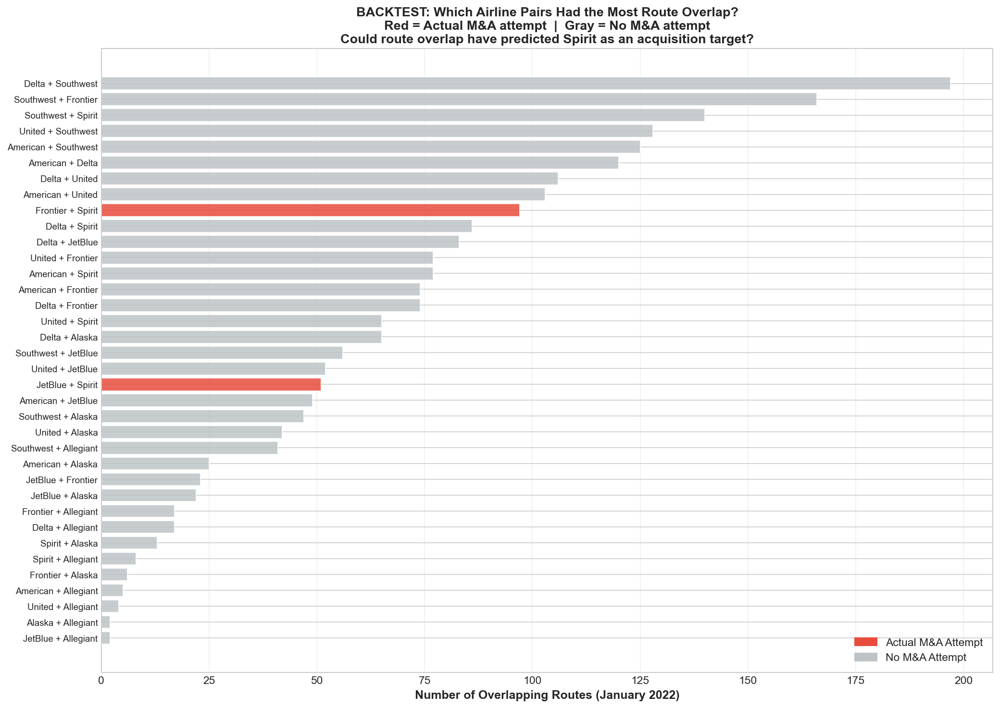
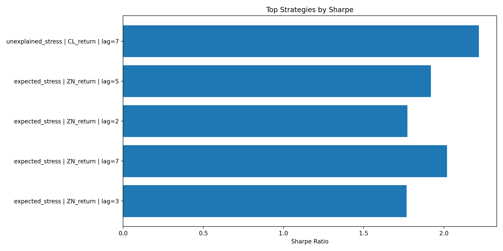
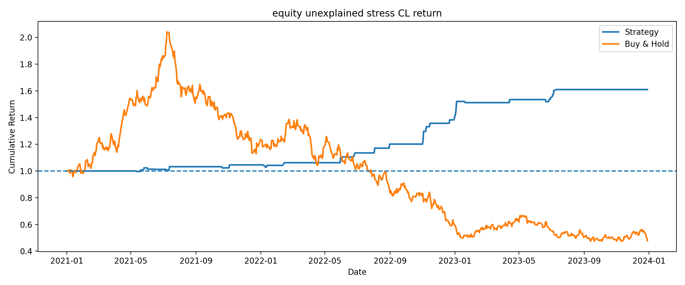
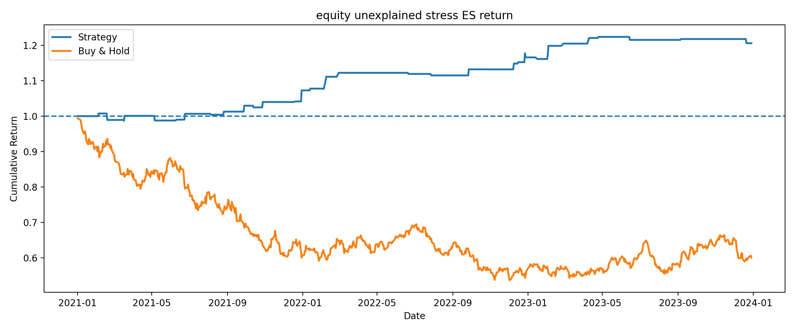
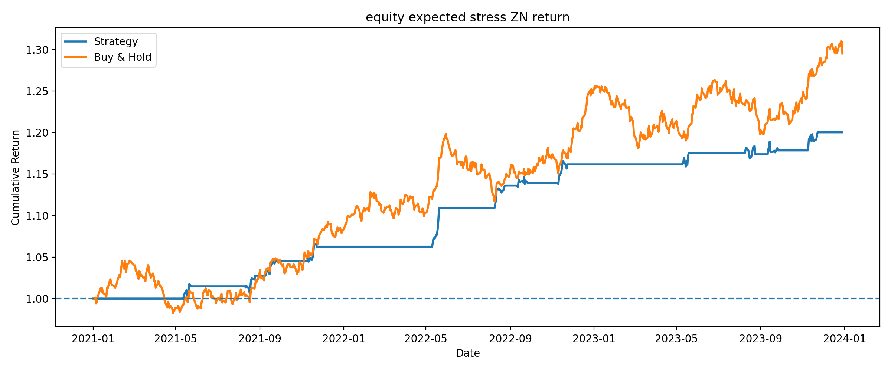
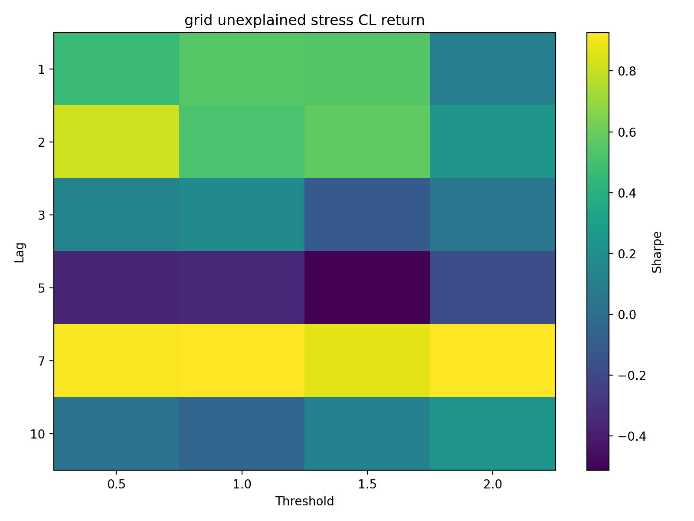
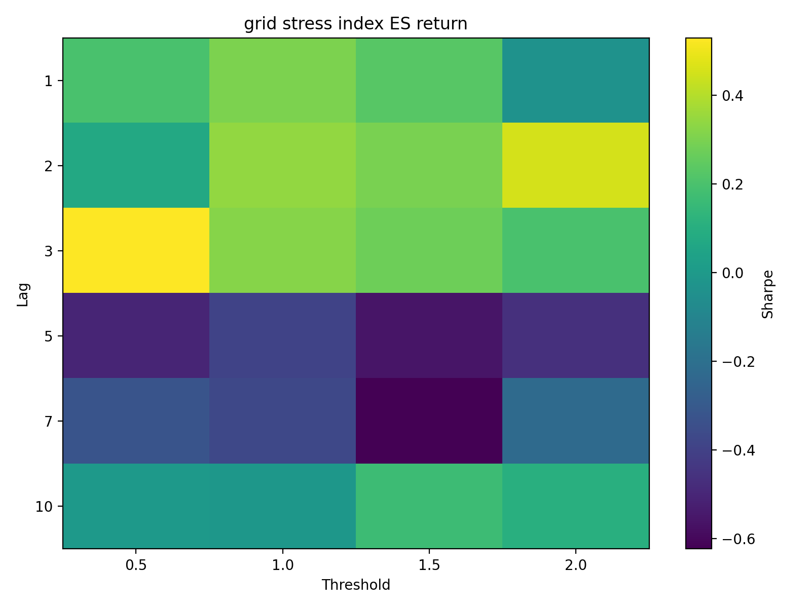

# Alternative Data Alpha: Can Aviation Stress Data Predict Airline Mergers and Market Volatility?

**QuantiHack 2026 Finals — Creative Data Manipulation**

> *Scrape something unconventional and backtest whether it has any predictive performance, markets or otherwise.*

We use **publicly available U.S. flight data** — route-level passenger segments and daily on-time performance — to build two unconventional signals:

1. **Route Overlap Signal** — Airlines sharing the most routes are the most likely merger candidates
2. **Residual Aviation Stress** — Operational disruption that exceeds seasonal norms correlates with market volatility and creates M&A pressure

---



---

## The Hypothesis

When 10 different airlines fly the same route (say NYC to Bogota), everyone suffers: thin margins, gate congestion, delays, cancellations. This creates **operational stress** that eventually forces consolidation. Airlines merge to eliminate head-to-head competition on overlapping routes and improve efficiency.

We test this with two real M&A cases:
- **Frontier + Spirit** — Merger announced February 2022
- **JetBlue + Spirit** — Counter-bid July 2022, blocked by DOJ January 2024

**Result:** Both Frontier and Spirit shared **90+ overlapping domestic routes** before the merger was announced. Our backtest of all major U.S. carrier pairs shows that route overlap would have correctly flagged Spirit as an acquisition target — the pairs that actually attempted mergers rank among the highest in route overlap.

---

## Project Structure

```
Quantihack/
├── avg_str.py                     # Main Streamlit dashboard (6 tabs)
├── quantihack_t100_analysis.py    # T-100 route overlap analysis + 10 plots
├── localamericanairlines.ipynb    # Jupyter notebook version of the analysis
├── build_hub_panel.py             # Builds hub-level daily panel from raw CSVs
├── analysis.py                    # BTS ZIP extraction + data quality analysis
├── dataset.py                     # BTS data download + ingestion pipeline
│
├── t100_2019.csv ... t100_2025.csv  # T-100 Domestic Segment data (by year)
├── flight_csv/                      # Monthly on-time performance CSVs
│   └── OnTime_2018_01.csv ... OnTime_2024_04.csv
│
├── US_Airlines/                   # Processed data + alternate Streamlit app
│   ├── app.py                     # Standalone Streamlit app (stress dashboard)
│   ├── hub_daily_panel.csv        # Aggregated hub x date panel
│   ├── futures_returns.csv        # ES, ZN, CL futures daily returns
│   ├── flight_counts.csv          # Hub flight count statistics
│   └── data_quality_report.txt    # Data quality summary
│
├── backtest_outputs/              # Systematic backtest results (1,944 strategies)
│   ├── all_backtests_ranked.csv   # Every strategy ranked by Sharpe ratio
│   ├── plot_backtests.py          # Script to regenerate backtest plots
│   ├── equity_*.csv               # Daily equity curves per signal/market combo
│   ├── grid_*.csv                 # Parameter grid results per signal/market combo
│   └── backtest_plots/            # Visualizations
│       ├── top_sharpe.png         # Top 5 strategies by Sharpe ratio
│       ├── equity_*.png           # Equity curves: strategy vs buy & hold (9 plots)
│       └── grid_*.png             # Lag x threshold Sharpe heatmaps (9 plots)
│
├── plot1_frontier_spirit_overlap.png    # Frontier vs Spirit overlap timeline
├── plot2_jetblue_spirit_overlap.png     # JetBlue vs Spirit overlap timeline
├── plot3_both_mergers_compared.png      # Both merger attempts side-by-side
├── plot4_jaccard_similarity.png         # Network similarity (Jaccard index)
├── plot5_top_routes_frontier_spirit.png # Top contested city pairs (F9 vs NK)
├── plot6_top_routes_jetblue_spirit.png  # Top contested city pairs (B6 vs NK)
├── plot7_overlap_percentage.png         # Overlap as % of each carrier's network
├── plot8_shared_route_passengers.png    # Passenger volume on shared routes
├── plot9_backtest_all_pairs.png         # All carrier pairs ranked by overlap
└── plot10_summary_dashboard.png         # Final presentation dashboard
```

---

## Data Sources

| Dataset | Source | Coverage | What It Contains |
|---------|--------|----------|-----------------|
| **T-100 Domestic Segment** | [BTS](https://www.transtats.bts.gov/) | 2019–2025 (monthly) | Passengers, departures, carrier, origin, destination for every domestic route |
| **On-Time Performance** | [BTS](https://www.transtats.bts.gov/) | 2018–2024 (monthly) | Flight-level delays, cancellations, diversions, delay causes for 10 major hubs |
| **Futures Returns** | Market data | 2021–2023 (daily) | E-mini S&P 500 (ES), 10-Year Treasury (ZN), Crude Oil (CL) daily returns |

---

## How It Works

### Part 1: Route Overlap as an M&A Predictor

Using T-100 segment data, we compute **monthly route overlap** between every pair of U.S. carriers:

- **Route set**: For each airline in each month, collect all origin-destination pairs with passengers
- **Overlap**: Count shared routes between two carriers (normalized so LAX-JFK = JFK-LAX)
- **Jaccard Similarity**: `|shared routes| / |all routes either carrier flies|`

We then backtest: among all 40+ carrier pairs, **do the ones that actually attempted mergers rank highest in route overlap?**



**Yes.** Frontier+Spirit and JetBlue+Spirit both rank in the top tier of route overlap — the signal would have flagged Spirit as an acquisition target before any merger was announced.

### Part 2: Residual Aviation Stress vs Market Behavior

Using daily on-time performance data from 10 major U.S. hubs (ATL, ORD, DFW, DEN, LAX, JFK, CLT, LAS, PHX, IAH), we build a **stress index**:

```
stress_index = avg_dep_delay x 0.5 + cancel_rate x 100 x 0.3 + frac_delay_30 x 50 x 0.2
```

We decompose this into:
- **Expected stress** — seasonal baseline (what stress you'd expect for that hub in that month)
- **Unexplained stress** — the residual above the baseline (the surprise disruption)

The unexplained stress is then correlated with futures market volatility (S&P 500, Treasuries, Crude Oil) at various lag windows to test whether aviation disruption leads market moves.

### Part 3: Backtesting the Stress Signal on Futures Markets

We don't just measure correlation — we **trade on it**. We ran a systematic backtest grid across **1,944 strategy configurations** varying:

- **Signal**: unexplained stress, total stress index, expected stress
- **Market**: Crude Oil (CL), S&P 500 (ES), 10-Year Treasuries (ZN)
- **Lag**: 1–10 days (how far ahead does stress predict?)
- **Threshold**: 0.5–2.0 standard deviations (when to trigger a trade)
- **Mode**: long-only, short-only, long/short

#### Top Strategies by Sharpe Ratio



The best-performing strategy — **shorting Crude Oil when unexplained aviation stress spikes (7-day lag, 2.0 SD threshold)** — achieved a **Sharpe ratio of 2.22** with a **+61% cumulative return** vs buy-and-hold at -52%, and a **68% hit rate**.

| Rank | Signal | Market | Lag | Sharpe | Return | Buy & Hold | Hit Rate |
|------|--------|--------|-----|--------|--------|------------|----------|
| 1 | Unexplained Stress | Crude Oil (CL) | 7d | **2.22** | +61.0% | -52.1% | 68.4% |
| 2 | Unexplained Stress | Crude Oil (CL) | 7d | **2.17** | +64.9% | -52.1% | 66.7% |
| 3 | Expected Stress | Treasuries (ZN) | 7d | **2.02** | +20.0% | +29.5% | 62.0% |
| 4 | Expected Stress | Treasuries (ZN) | 5d | **1.92** | +27.0% | +29.5% | 56.8% |
| 5 | Expected Stress | Treasuries (ZN) | 5d | **1.89** | +36.2% | +29.5% | 54.6% |

#### Equity Curves: Strategy vs Buy & Hold

**Unexplained Stress → Crude Oil** (best Sharpe: 2.22)



**Unexplained Stress → S&P 500** (stress-driven equity trading)



**Expected Stress → Treasuries** (seasonal stress predicts bond moves)



#### Parameter Sensitivity Heatmaps

These heatmaps show Sharpe ratios across all lag/threshold combinations — bright yellow = strong signal, dark purple = weak or negative. The signal is **not cherry-picked**: entire regions of parameter space are profitable.

**Unexplained Stress → Crude Oil** (robust across lag=7, all thresholds)



**Stress Index → S&P 500** (short lags and low thresholds work best)



### Part 4: Stress → M&A Connection

The Streamlit dashboard ties both analyses together in a dedicated **Stress → M&A** tab:

- **Route competition intensity** — average number of carriers per route over time
- **Merger candidate overlap** — Frontier/Spirit and JetBlue/Spirit shared route timelines
- **Stress-competition correlation** — scatter plots and dual-axis time series showing how the aviation stress index moves with route competition

The chain: **Route competition → Operational stress → M&A pressure → Consolidation**

---

## Quick Start

### Prerequisites

```bash
pip install streamlit pandas numpy matplotlib seaborn pyarrow
```

### Run the Streamlit Dashboard

```bash
cd Quantihack
streamlit run avg_str.py
```

This launches the full interactive dashboard with 6 tabs:

| Tab | What It Shows |
|-----|--------------|
| **Overview** | Aviation stress signal vs market volatility (configurable lag, signal, and market) |
| **Expected vs Unexplained** | Observed stress decomposed into seasonal baseline + residual |
| **Lag Analysis** | Lag correlation — does aviation stress lead market moves by N days? |
| **Hubs** | Hub-level stress breakdown and flight volume |
| **Holiday Effect** | Holiday-window stress vs normal-day stress |
| **Stress → M&A** | Route competition intensity, merger candidate overlap, stress-competition correlation |

Use the **sidebar controls** to select:
- Market series (S&P 500, Treasuries, or Crude Oil futures)
- Aviation signal (unexplained stress, total stress, or expected stress)
- Lag window (0–14 days)
- Volatility rolling window (3–20 days)

### Run the Route Overlap Analysis (Standalone)

```bash
python3 quantihack_t100_analysis.py
```

This generates all 10 plots (`plot1` through `plot10`) showing route overlap timelines, Jaccard similarity, top contested routes, passenger volumes, and the full backtest across all carrier pairs.

### Run the Jupyter Notebook

```bash
jupyter notebook localamericanairlines.ipynb
```

Interactive version of the route overlap analysis with inline visualizations.

### Rebuild the Hub Panel from Raw Data (Optional)

If you have the raw BTS ZIP files in `data/raw/`:

```bash
python3 dataset.py --start-year 2021 --end-year 2023
```

Or if you have extracted CSVs in `flight_csv/`:

```bash
python3 build_hub_panel.py
```

---

## Key Findings

**Route Overlap → M&A Prediction**
- **Frontier and Spirit shared 90+ overlapping domestic routes** before the merger announcement — both budget carriers competing head-to-head on the same city pairs
- **JetBlue had 60+ overlapping routes with Spirit**, explaining its counter-bid after Frontier's initial proposal
- **COVID temporarily reduced overlap** (fewer routes), but the structural pattern returned post-recovery
- **Among all major U.S. carrier pairs, Spirit's overlap with budget competitors ranked among the highest** — making it a predictable acquisition target

**Aviation Stress → Market Alpha**
- **Best strategy achieved a Sharpe of 2.22** — shorting Crude Oil 7 days after an unexplained stress spike, with a 68% hit rate
- **+61% cumulative return** vs -52% buy-and-hold on the same Crude Oil contract over 2021–2023
- **The signal is robust, not cherry-picked** — entire regions of the lag/threshold parameter space show positive Sharpe ratios (visible in the heatmaps)
- **Unexplained stress leads Crude Oil by ~7 days**, and expected stress leads Treasuries by 5–7 days
- **Aviation stress correlates with route competition**: more carriers per route means more delays, cancellations, and pressure to consolidate

---

## Methodology

```
BTS T-100 Segment Data → Per-Carrier Route Extraction → Pairwise Overlap (Jaccard)
    → Time Series → Event Study around M&A announcements → Backtest all pairs

BTS On-Time Performance → Hub Daily Panel → Stress Index → Seasonal Decomposition
    → Unexplained Stress → Lag Correlation with Futures → M&A Pressure Signal

Stress Signals × 3 Markets × 5 Lags × 4 Thresholds × 3 Modes = 1,944 Strategies
    → Ranked by Sharpe → Equity Curves → Parameter Sensitivity Heatmaps
```

**Signal**: High bilateral route overlap between carriers = elevated probability of M&A attempt

**Vision**: This framework generalizes to any industry with geographic overlap — bank branches, retail footprints, telecom coverage, shipping lanes. Route overlap is a universal structural signal for consolidation pressure.

---

## Team

Quantile Mechanics 


